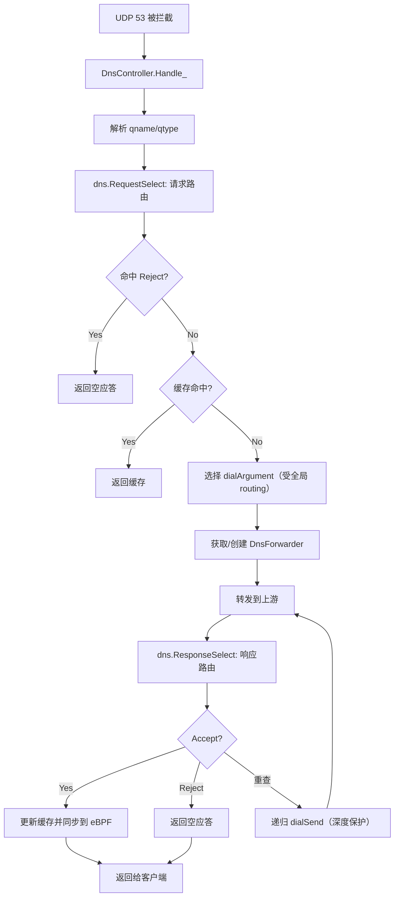

# DNS 功能设计与工作流程

## 整体流程概览



## 1. 配置解析与结构初始化

- `dns` 段由 `component/dns/dns.New` 解析，构建 `Dns` 结构，包含 `upstream` 列表、`reqMatcher` 与 `respMatcher`（分别对应 request/response 路由） [1](#1-0) 。
- 上游定义支持多种协议（udp/tcp/tcp+udp/https/tls/h3/http3/quic），在 `upstream` 块中声明并打 tag，供路由引用 [2](#1-1) 。
- `dns.routing.request` 决定“用哪个上游查”，支持 `qname/qtype` 匹配与 `fallback`；`dns.routing.response` 决定“接受/拒绝/重查”，支持 `qname/qtype/ip/upstream` [3](#1-2) 。
- 规则在初始化时经过优化器（DatReader、MergeAndSort、Deduplicate）处理 [4](#1-3) 。

## 2. 控制层初始化（DnsController）

- 在控制平面创建时，通过 `NewDnsController` 将 `dns.Dns` 实例传入，并注入回调（缓存访问/移除、新建缓存、BestDialerChooser、超时上报） [5](#1-4) 。
- `DnsController` 持有 `dnsCache`、`dnsForwarderCache`、`fixedDomainTtl` 与 `ipversion_prefer` 等状态 [6](#1-5) 。

## 3. 请求处理流程

### 3.1 入口与并发双栈（ipversion_prefer）

- `Handle_` 为入口，若启用 `ipversion_prefer` 且请求为 A/AAAA，会并发查询 A 与 AAAA，最后根据偏好返回其一 [7](#1-6) 。

### 3.2 请求路由（RequestSelect）

- 调用 `c.routing.RequestSelect(qname, qtype)` 获取上游索引与 Upstream 对象 [8](#1-7) 。
- 若命中 Reject，直接返回空应答 [9](#1-8) 。

### 3.3 缓存与去重

- 使用 `handling` map 防止相同查询并发执行 [10](#1-9) 。
- 优先返回缓存（若未过期） [11](#1-10) 。

### 3.4 选择 dialArgument（受全局 routing）

- 通过 `bestDialerChooser(req, upstream)` 选取出站、拨号器、四层协议与 IP 版本等，关键逻辑在控制平面实现，受全局 `routing` 影响 [12](#1-11) 。

### 3.5 转发与 forwarder 缓存

- 按 `dnsForwarderKey` 缓存转发器，避免重复创建连接 [13](#1-12) 。
- 调用 `forwarder.ForwardDNS` 将请求发往上游 [14](#1-13) 。

## 4. 响应路由与递归重查

- 收到响应后执行 `c.routing.ResponseSelect(respMsg, upstream)`，决定 Accept/Reject/重查 [15](#1-14) 。
- 若为重查，递归调用 `dialSend`，受 `MaxDnsLookupDepth` 保护防止死循环 [16](#1-15) 。
- Accept 时写入缓存，触发 `CacheAccessCallback` 将域名与 IP 映射写入 eBPF 域名路由表 [17](#1-16) 。

## 5. 转发层实现（按协议）

- `newDnsForwarder` 根据 `l4proto` 与上游 Scheme 创建对应实现（DoUDP/DoTCP/DoTLS/DoH/DoQ） [18](#1-17) 。
- 各转发器使用选定的 `bestDialer` 建立连接并完成 DNS 报文交互。

## 6. 与全局路由的交互

- “连接到 DNS 上游”是否走代理，由全局 `routing` 决定，而非 `dns.routing` [19](#1-18) 。
- 因此，即使 `dns.routing.request` 指向海外 DNS，若全局 routing 未将其 IP/域名设为 `direct`，该连接仍会走代理组的 `fallback` [20](#1-19) [21](#1-20) 。

## 7. 缓存与 eBPF 同步

- `CacheAccessCallback` 与 `CacheRemoveCallback` 负责将 DNS 解析结果同步到内核 eBPF 的 DomainRoutingMap，供后续按域名分流使用 [22](#1-21) 。
- `fixed_domain_ttl` 可为特定域名设置固定 TTL，0 表示不缓存 [23](#1-22) 。

## Notes
- DNS 拦截基于 eBPF 在 tc 层进行，确保 UDP 53 流量必经 dae，否则按域名分流失效 [24](#1-23) 。
- `asis` 行为会将请求发往原始目标地址，需避免回环配置 [25](#1-24) 。
- 递归重查机制常用于“污染检测与重查”模板，先走国内 DNS，若返回私有 IP 则重查到可信海外 DNS [26](#1-25) 。

Wiki pages you might want to explore:
- [Basic Configuration (daeuniverse/dae)](/wiki/daeuniverse/dae#2.2)

### Citations

**File:** component/dns/dns.go (L41-127)
```go
func New(dns *config.Dns, opt *NewOption) (s *Dns, err error) {
	s = &Dns{
		log: opt.Logger,
		upstream2Index: map[*Upstream]int{
			nil: int(consts.DnsRequestOutboundIndex_AsIs),
		},
	}
	// Parse upstream.
	upstreamName2Id := map[string]uint8{}
	for i, upstreamRaw := range dns.Upstream {
		if i >= int(consts.DnsRequestOutboundIndex_UserDefinedMax) ||
			i >= int(consts.DnsResponseOutboundIndex_UserDefinedMax) {
			return nil, fmt.Errorf("too many upstreams")
		}

		tag, link := common.GetTagFromLinkLikePlaintext(string(upstreamRaw))
		if tag == "" {
			return nil, fmt.Errorf("%w: '%v' has no tag", ErrBadUpstreamFormat, upstreamRaw)
		}
		var u *url.URL
		u, err = url.Parse(link)
		if err != nil {
			return nil, fmt.Errorf("%w: %v", ErrBadUpstreamFormat, err)
		}
		r := &UpstreamResolver{
			Raw:     u,
			Network: opt.UpstreamResolverNetwork,
			FinishInitCallback: func(i int) func(raw *url.URL, upstream *Upstream) (err error) {
				return func(raw *url.URL, upstream *Upstream) (err error) {
					if opt != nil && opt.UpstreamReadyCallback != nil {
						if err = opt.UpstreamReadyCallback(upstream); err != nil {
							return err
						}
					}

					s.upstream2IndexMu.Lock()
					s.upstream2Index[upstream] = i
					s.upstream2IndexMu.Unlock()
					return nil
				}
			}(i),
			mu:       sync.Mutex{},
			upstream: nil,
			init:     false,
		}
		upstreamName2Id[tag] = uint8(len(s.upstream))
		s.upstream = append(s.upstream, r)
	}
	// Optimize routings.
	if dns.Routing.Request.Rules, err = routing.ApplyRulesOptimizers(dns.Routing.Request.Rules,
		&routing.DatReaderOptimizer{Logger: opt.Logger, LocationFinder: opt.LocationFinder},
		&routing.MergeAndSortRulesOptimizer{},
		&routing.DeduplicateParamsOptimizer{},
	); err != nil {
		return nil, err
	}
	if dns.Routing.Response.Rules, err = routing.ApplyRulesOptimizers(dns.Routing.Response.Rules,
		&routing.DatReaderOptimizer{Logger: opt.Logger, LocationFinder: opt.LocationFinder},
		&routing.MergeAndSortRulesOptimizer{},
		&routing.DeduplicateParamsOptimizer{},
	); err != nil {
		return nil, err
	}
	// Parse request routing.
	reqMatcherBuilder, err := NewRequestMatcherBuilder(opt.Logger, dns.Routing.Request.Rules, upstreamName2Id, dns.Routing.Request.Fallback)
	if err != nil {
		return nil, fmt.Errorf("failed to build DNS request routing: %w", err)
	}
	s.reqMatcher, err = reqMatcherBuilder.Build()
	if err != nil {
		return nil, fmt.Errorf("failed to build DNS request routing: %w", err)
	}
	// Parse response routing.
	respMatcherBuilder, err := NewResponseMatcherBuilder(opt.Logger, dns.Routing.Response.Rules, upstreamName2Id, dns.Routing.Response.Fallback)
	if err != nil {
		return nil, fmt.Errorf("failed to build DNS response routing: %w", err)
	}
	s.respMatcher, err = respMatcherBuilder.Build()
	if err != nil {
		return nil, fmt.Errorf("failed to build DNS response routing: %w", err)
	}
	if len(dns.Upstream) == 0 {
		// Immediately ready.
		go opt.UpstreamReadyCallback(nil)
	}
	return s, nil
}
```

**File:** docs/en/configuration/dns.md (L7-63)
```markdown
DoH3

```
h3://<host>:<port>/<path>
http3://<host>:<port>/<path>

default port: 443
default path: /dns-query
```

DoH

```
https://<host>:<port>/<path>

default port: 443
default path: /dns-query
```

DoT

```
tls://<host>:<port>

default port: 853
```

DoQ

```
quic://<host>:<port>

default port: 853
```

UDP
  
```
udp://<host>:<port>

default port: 53
```

TCP

```
tcp://<host>:<port>

default port: 53
```

TCP and UDP

```
tcp+udp://<host>:<port>

default port: 53
```

**File:** docs/en/configuration/dns.md (L105-143)
```markdown
    # The routing format of 'request' and 'response' is similar with section 'routing'.
    # See https://github.com/daeuniverse/dae/blob/main/docs/en/configuration/routing.md
    routing {
        # According to the request of dns query, decide to use which DNS upstream.
        # Match rules from top to bottom.
        request {
            # Built-in outbounds in 'request': asis, reject.
            # You can also use user-defined upstreams.

            # Available functions: qname, qtype.

            # DNS request name (omit suffix dot '.').
            qname(geosite:category-ads-all) -> reject
            qname(geosite:google@cn) -> alidns # Also see: https://github.com/v2fly/domain-list-community#attributes
            qname(suffix: abc.com, keyword: google) -> googledns
            qname(full: ok.com, regex: '^yes') -> googledns
            # DNS request type
            qtype(a, aaaa) -> alidns
            qtype(cname) -> googledns
            # disable ECH to avoid affecting traffic split
            qtype(https) -> reject
            # If no match, fallback to this upstream.
            fallback: asis
        }
        # According to the response of dns query, decide to accept or re-lookup using another DNS upstream.
        # Match rules from top to bottom.
        response {
            # Built-in outbounds in 'response': accept, reject.
            # You can use user-defined upstreams.

            # Available functions: qname, qtype, upstream, ip.
            # Accept the response if the request is sent to upstream 'googledns'. This is useful to avoid loop.
            upstream(googledns) -> accept
            # If DNS request name is not in CN and response answers include private IP, which is most likely polluted
            # in China mainland. Therefore, resend DNS request to 'googledns' to get correct result.
            ip(geoip:private) && !qname(geosite:cn) -> googledns
            fallback: accept
        }
    }
```

**File:** docs/en/configuration/dns.md (L170-196)
```markdown
```shell
# Use alidns for all DNS queries and fallback to googledns if pollution result detected.
dns {
  upstream {
    googledns: 'tcp+udp://dns.google:53'
    alidns: 'udp://dns.alidns.com:53'
  }
  routing {
    # According to the request of dns query, decide to use which DNS upstream.
    # Match rules from top to bottom.
    request {
      # fallback is also called default.
      fallback: alidns
    }
    # According to the response of dns query, decide to accept or re-lookup using another DNS upstream.
    # Match rules from top to bottom.
    response {
      # Trusted upstream. Always accept its result.
      upstream(googledns) -> accept
      # Possibly polluted, re-lookup using googledns.
      ip(geoip:private) && !qname(geosite:cn) -> googledns
      # fallback is also called default.
      fallback: accept
    }
  }
}
```
```

**File:** control/control_plane.go (L413-466)
```go
	/// DNS upstream.
	dnsUpstream, err := dns.New(dnsConfig, &dns.NewOption{
		Logger:                  log,
		LocationFinder:          locationFinder,
		UpstreamReadyCallback:   plane.dnsUpstreamReadyCallback,
		UpstreamResolverNetwork: common.MagicNetwork("udp", global.SoMarkFromDae, global.Mptcp),
	})
	if err != nil {
		return nil, err
	}
	/// Dns controller.
	fixedDomainTtl, err := ParseFixedDomainTtl(dnsConfig.FixedDomainTtl)
	if err != nil {
		return nil, err
	}
	if plane.dnsController, err = NewDnsController(dnsUpstream, &DnsControllerOption{
		Log: log,
		CacheAccessCallback: func(cache *DnsCache) (err error) {
			// Write mappings into eBPF map:
			// IP record (from dns lookup) -> domain routing
			if err = core.BatchUpdateDomainRouting(cache); err != nil {
				return fmt.Errorf("BatchUpdateDomainRouting: %w", err)
			}
			return nil
		},
		CacheRemoveCallback: func(cache *DnsCache) (err error) {
			// Write mappings into eBPF map:
			// IP record (from dns lookup) -> domain routing
			if err = core.BatchRemoveDomainRouting(cache); err != nil {
				return fmt.Errorf("BatchUpdateDomainRouting: %w", err)
			}
			return nil
		},
		NewCache: func(fqdn string, answers []dnsmessage.RR, deadline time.Time, originalDeadline time.Time) (cache *DnsCache, err error) {
			return &DnsCache{
				DomainBitmap:     plane.routingMatcher.domainMatcher.MatchDomainBitmap(fqdn),
				Answer:           answers,
				Deadline:         deadline,
				OriginalDeadline: originalDeadline,
			}, nil
		},
		BestDialerChooser: plane.chooseBestDnsDialer,
		TimeoutExceedCallback: func(dialArgument *dialArgument, err error) {
			dialArgument.bestDialer.ReportUnavailable(&dialer.NetworkType{
				L4Proto:   dialArgument.l4proto,
				IpVersion: dialArgument.ipversion,
				IsDns:     true,
			}, err)
		},
		IpVersionPrefer: dnsConfig.IpVersionPrefer,
		FixedDomainTtl:  fixedDomainTtl,
	}); err != nil {
		return nil, err
	}
```

**File:** control/dns_control.go (L64-84)
```go
type DnsController struct {
	handling sync.Map

	routing     *dns.Dns
	qtypePrefer uint16

	log                 *logrus.Logger
	cacheAccessCallback func(cache *DnsCache) (err error)
	cacheRemoveCallback func(cache *DnsCache) (err error)
	newCache            func(fqdn string, answers []dnsmessage.RR, deadline time.Time, originalDeadline time.Time) (cache *DnsCache, err error)
	bestDialerChooser   func(req *udpRequest, upstream *dns.Upstream) (*dialArgument, error)
	// timeoutExceedCallback is used to report this dialer is broken for the NetworkType
	timeoutExceedCallback func(dialArgument *dialArgument, err error)

	fixedDomainTtl map[string]int
	// mutex protects the dnsCache.
	dnsCacheMu          sync.Mutex
	dnsCache            map[string]*DnsCache
	dnsForwarderCacheMu sync.Mutex
	dnsForwarderCache   map[dnsForwarderKey]DnsForwarder
}
```

**File:** control/dns_control.go (L360-431)
```go
func (c *DnsController) Handle_(dnsMessage *dnsmessage.Msg, req *udpRequest) (err error) {
	if c.log.IsLevelEnabled(logrus.TraceLevel) && len(dnsMessage.Question) > 0 {
		q := dnsMessage.Question[0]
		c.log.Tracef("Received UDP(DNS) %v <-> %v: %v %v",
			RefineSourceToShow(req.realSrc, req.realDst.Addr()), req.realDst.String(), strings.ToLower(q.Name), QtypeToString(q.Qtype),
		)
	}

	if dnsMessage.Response {
		return fmt.Errorf("DNS request expected but DNS response received")
	}

	// Prepare qname, qtype.
	var qname string
	var qtype uint16
	if len(dnsMessage.Question) != 0 {
		qname = dnsMessage.Question[0].Name
		qtype = dnsMessage.Question[0].Qtype
	}

	// Check ip version preference and qtype.
	switch qtype {
	case dnsmessage.TypeA, dnsmessage.TypeAAAA:
		if c.qtypePrefer == 0 {
			return c.handle_(dnsMessage, req, true)
		}
	default:
		return c.handle_(dnsMessage, req, true)
	}

	// Try to make both A and AAAA lookups.
	dnsMessage2 := deepcopy.Copy(dnsMessage).(*dnsmessage.Msg)
	dnsMessage2.Id = uint16(fastrand.Intn(math.MaxUint16))
	var qtype2 uint16
	switch qtype {
	case dnsmessage.TypeA:
		qtype2 = dnsmessage.TypeAAAA
	case dnsmessage.TypeAAAA:
		qtype2 = dnsmessage.TypeA
	default:
		return fmt.Errorf("unexpected qtype path")
	}
	dnsMessage2.Question[0].Qtype = qtype2

	done := make(chan struct{})
	go func() {
		_ = c.handle_(dnsMessage2, req, false)
		done <- struct{}{}
	}()
	err = c.handle_(dnsMessage, req, false)
	<-done
	if err != nil {
		return err
	}

	// Join results and consider whether to response.
	resp := c.LookupDnsRespCache_(dnsMessage, c.cacheKey(qname, qtype), true)
	if resp == nil {
		// resp is not valid.
		c.log.WithFields(logrus.Fields{
			"qname": qname,
		}).Tracef("Reject %v due to resp not valid", qtype)
		return c.sendReject_(dnsMessage, req)
	}
	// resp is valid.
	cache2 := c.LookupDnsRespCache(c.cacheKey(qname, qtype2), true)
	if c.qtypePrefer == qtype || cache2 == nil || !cache2.IncludeAnyIp() {
		return sendPkt(c.log, resp, req.realDst, req.realSrc, req.src, req.lConn)
	} else {
		return c.sendReject_(dnsMessage, req)
	}
}
```

**File:** control/dns_control.go (L447-451)
```go
	// Route request.
	upstreamIndex, upstream, err := c.routing.RequestSelect(qname, qtype)
	if err != nil {
		return err
	}
```

**File:** control/dns_control.go (L455-459)
```go
	if upstreamIndex == consts.DnsRequestOutboundIndex_Reject {
		// Reject with empty answer.
		c.RemoveDnsRespCache(cacheKey)
		return c.sendReject_(dnsMessage, req)
	}
```

**File:** control/dns_control.go (L461-472)
```go
	// No parallel for the same lookup.
	handlingState_, _ := c.handling.LoadOrStore(cacheKey, new(handlingState))
	handlingState := handlingState_.(*handlingState)
	atomic.AddUint32(&handlingState.ref, 1)
	handlingState.mu.Lock()
	defer func() {
		handlingState.mu.Unlock()
		atomic.AddUint32(&handlingState.ref, ^uint32(0))
		if atomic.LoadUint32(&handlingState.ref) == 0 {
			c.handling.Delete(cacheKey)
		}
	}()
```

**File:** control/dns_control.go (L474-488)
```go
	if resp := c.LookupDnsRespCache_(dnsMessage, cacheKey, false); resp != nil {
		// Send cache to client directly.
		if needResp {
			if err = sendPkt(c.log, resp, req.realDst, req.realSrc, req.src, req.lConn); err != nil {
				return fmt.Errorf("failed to write cached DNS resp: %w", err)
			}
		}
		if c.log.IsLevelEnabled(logrus.DebugLevel) && len(dnsMessage.Question) > 0 {
			q := dnsMessage.Question[0]
			c.log.Debugf("UDP(DNS) %v <-> Cache: %v %v",
				RefineSourceToShow(req.realSrc, req.realDst.Addr()), strings.ToLower(q.Name), QtypeToString(q.Qtype),
			)
		}
		return nil
	}
```

**File:** control/dns_control.go (L558-563)
```go
	// Select best dial arguments (outbound, dialer, l4proto, ipversion, etc.)
	dialArgument, err := c.bestDialerChooser(req, upstream)
	if err != nil {
		return err
	}

```

**File:** control/dns_control.go (L580-591)
```go
	// get forwarder from cache
	c.dnsForwarderCacheMu.Lock()
	forwarder, ok := c.dnsForwarderCache[dnsForwarderKey{upstream: upstream.String(), dialArgument: *dialArgument}]
	if !ok {
		forwarder, err = newDnsForwarder(upstream, *dialArgument)
		if err != nil {
			c.dnsForwarderCacheMu.Unlock()
			return err
		}
		c.dnsForwarderCache[dnsForwarderKey{upstream: upstream.String(), dialArgument: *dialArgument}] = forwarder
	}
	c.dnsForwarderCacheMu.Unlock()
```

**File:** control/dns_control.go (L603-606)
```go
	respMsg, err = forwarder.ForwardDNS(ctxDial, data)
	if err != nil {
		return err
	}
```

**File:** control/dns_control.go (L612-616)
```go
	// Route response.
	upstreamIndex, nextUpstream, err := c.routing.ResponseSelect(respMsg, upstream)
	if err != nil {
		return err
	}
```

**File:** control/dns_control.go (L632-645)
```go
				"upstream": upstreamName,
			}).Traceln("Reject with empty answer")
		}
		// We also cache response reject.
	default:
		if c.log.IsLevelEnabled(logrus.TraceLevel) {
			c.log.WithFields(logrus.Fields{
				"question":      respMsg.Question,
				"last_upstream": upstreamName,
				"next_upstream": nextUpstream.String(),
			}).Traceln("Change DNS upstream and resend")
		}
		return c.dialSend(invokingDepth+1, req, data, id, nextUpstream, needResp)
	}
```

**File:** control/dns.go (L36-68)
```go
func newDnsForwarder(upstream *dns.Upstream, dialArgument dialArgument) (DnsForwarder, error) {
	forwarder, err := func() (DnsForwarder, error) {
		switch dialArgument.l4proto {
		case consts.L4ProtoStr_TCP:
			switch upstream.Scheme {
			case dns.UpstreamScheme_TCP, dns.UpstreamScheme_TCP_UDP:
				return &DoTCP{Upstream: *upstream, Dialer: dialArgument.bestDialer, dialArgument: dialArgument}, nil
			case dns.UpstreamScheme_TLS:
				return &DoTLS{Upstream: *upstream, Dialer: dialArgument.bestDialer, dialArgument: dialArgument}, nil
			case dns.UpstreamScheme_HTTPS:
				return &DoH{Upstream: *upstream, Dialer: dialArgument.bestDialer, dialArgument: dialArgument, http3: false}, nil
			default:
				return nil, fmt.Errorf("unexpected scheme: %v", upstream.Scheme)
			}
		case consts.L4ProtoStr_UDP:
			switch upstream.Scheme {
			case dns.UpstreamScheme_UDP, dns.UpstreamScheme_TCP_UDP:
				return &DoUDP{Upstream: *upstream, Dialer: dialArgument.bestDialer, dialArgument: dialArgument}, nil
			case dns.UpstreamScheme_QUIC:
				return &DoQ{Upstream: *upstream, Dialer: dialArgument.bestDialer, dialArgument: dialArgument}, nil
			case dns.UpstreamScheme_H3:
				return &DoH{Upstream: *upstream, Dialer: dialArgument.bestDialer, dialArgument: dialArgument, http3: true}, nil
			default:
				return nil, fmt.Errorf("unexpected scheme: %v", upstream.Scheme)
			}
		default:
			return nil, fmt.Errorf("unexpected l4proto: %v", dialArgument.l4proto)
		}
	}()
	if err != nil {
		return nil, err
	}
	return forwarder, nil
```

**File:** docs/zh/configuration/dns.md (L73-77)
```markdown
    # 为域名设定固定的 ttl。若设为 0，dae 不缓存该域名 DNS 记录，收到请求时每次向上游查询。
    fixed_domain_ttl {
        ddns.example.org: 10
        test.example.org: 3600
    }
```

**File:** docs/zh/configuration/dns.md (L81-83)
```markdown
        # 若主机为域名且具有 A 和 AAAA 记录，dae 自动选择 IPv4 或 IPv6 进行连接,
        # 是否走代理取决于全局的 routing（不是下面 dns 配置部分的 routing），节点选择取决于 group 的策略。
        # 请确保DNS流量经过dae且由dae转发，按域名分流需要如此！
```

**File:** docs/zh/configuration/dns.md (L109-111)
```markdown
            # 'request' 具有预置出站：asis, reject。
            # asis 即向收到的 DNS 请求中的目标服务器查询，请勿将其他局域网设备 DNS 服务器设为 dae:53（小心回环）。
            # 你可以使用在 upstream 中配置的 DNS 上游。
```

**File:** example.dae (L305-305)
```text
    fallback: my_group
```

**File:** docs/en/how-it-works.md (L19-26)
```markdown
The **domain name** is obtained by intercepting DNS requests and associating the requested domain name with the corresponding IP address. However, this method has some potential issues:

1. It might lead to misjudgment. For example, if a domestic and a foreign website sharing the same IP address are accessed simultaneously within a short period, or if the browser employs DNS caching.
2. The user's DNS requests must traverse dae. This can be achieved by setting dae as the DNS server or using a public DNS while dae serves as the gateway.

Despite these challenges, this approach is already an optimal solution compared to other methods. For instance, the Fake IP approach cannot perform IP-based splitting and is plagued by severe cache pollution issues. Similarly, domain sniffing can only intercept traffic like TLS/HTTP. While SNI sniffing for traffic splitting is effective, eBPF's limitations on program complexity and its lack of support for loops prevent us from implementing domain sniffing in the kernel space.

Hence, if DNS requests cannot pass through dae, domain-based splitting will not succeed.
```
